# FindWork

FindWork is a plartform where employers and employees can post and find Jobs.


## Tech Stack

**Client:** HTML, CSS

**Server:** PHP


## Installation

- Navigate to your `htdocs` folder

    ```bash
    cd C:\xampp\htdocs
    ```

- Clone the project

    ```bash
    git clone https://link-to-project
    ```

- Go to the project directory

    ```bash
    cd find-work
    ```

- Open your browser and paste the URL below

    ```bash
    http://localhost/phpmyadmin/
    ```

- Create a new database named `find_work` 
- Look for `import` tab on the page
- Click on upload a file. Then navigate to the SQL file located in the `database` folder or using the file path below 

	```bash
	find-work/assets/database/find_work.sql
	```

- Then run the SQL file. Then after, visit your browser and visit the URL below: 
	```bash
	http://localhost/find-work/
	```

    If you see a home page like the one below, then the application is set for users or employers to register.

    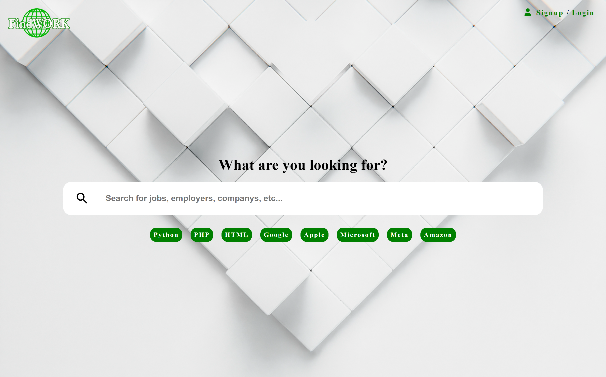

## Features

- Job Posting
- Job Application
- Login/Signup & Logout
- Profile Management 
- Job Status Awareness
- Job Approval & Rejection


## FAQ

#### How to Create a user?

Navigate to `http://localhost/find-work/signup.php`, then you fill the required informations and proceed. Your signup will be complete when you see the dashboard page.

#### Can Employers create users

No. Anyone can create an account by just visiting the signup page and filling the required information.


## Acknowledgements

 - [NFSFU234 Form Validation Library](https://github.com/nforshifu234dev/nfsfu234-form-validation/)
    - For Validating The Forms.


## Screenshots


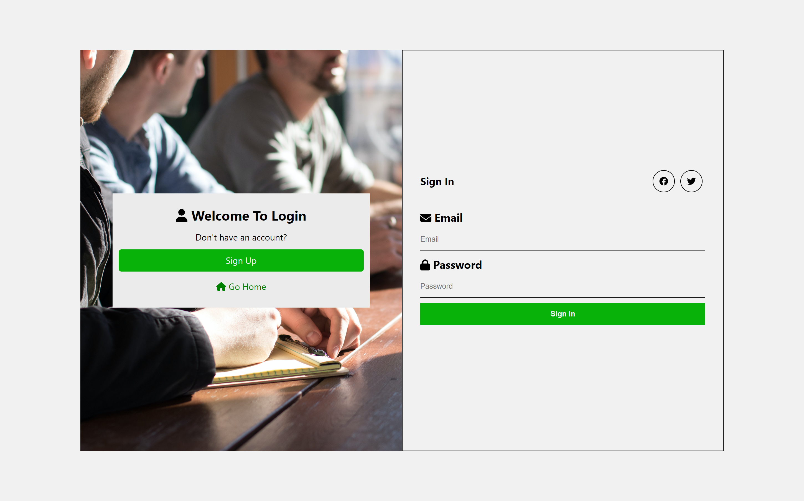

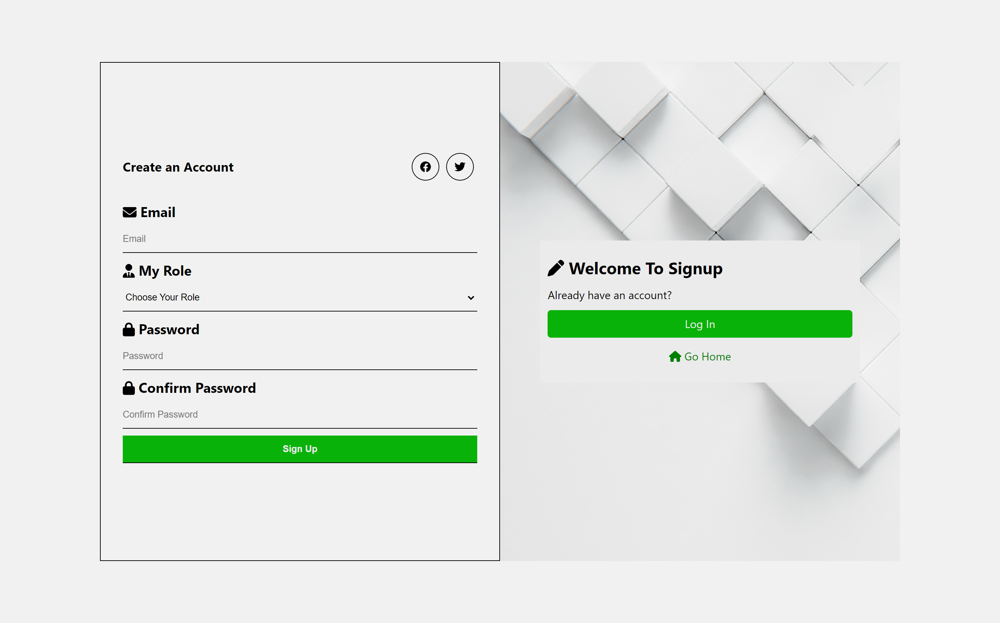


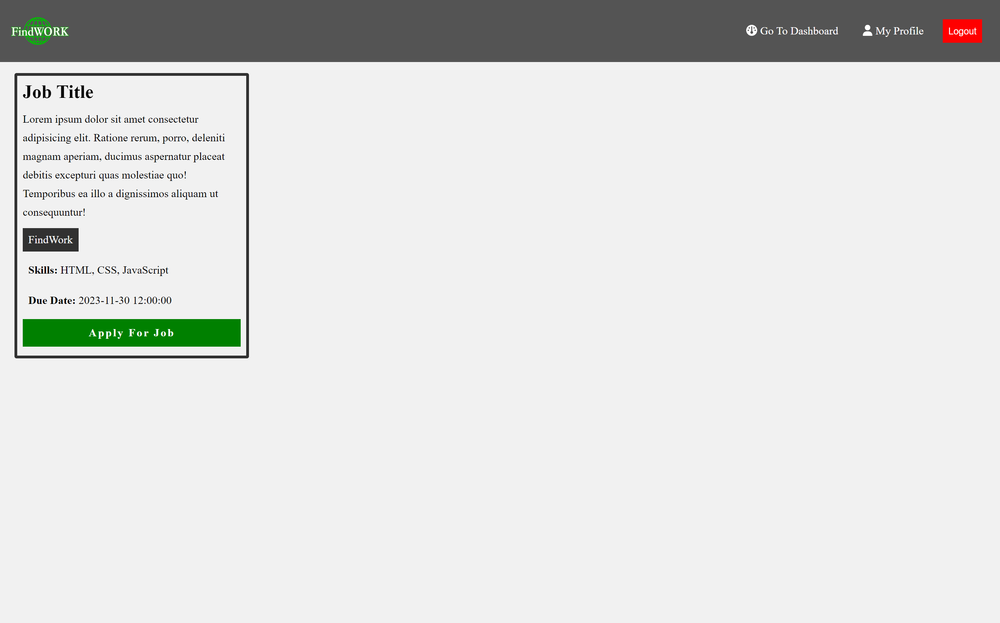


## Employers

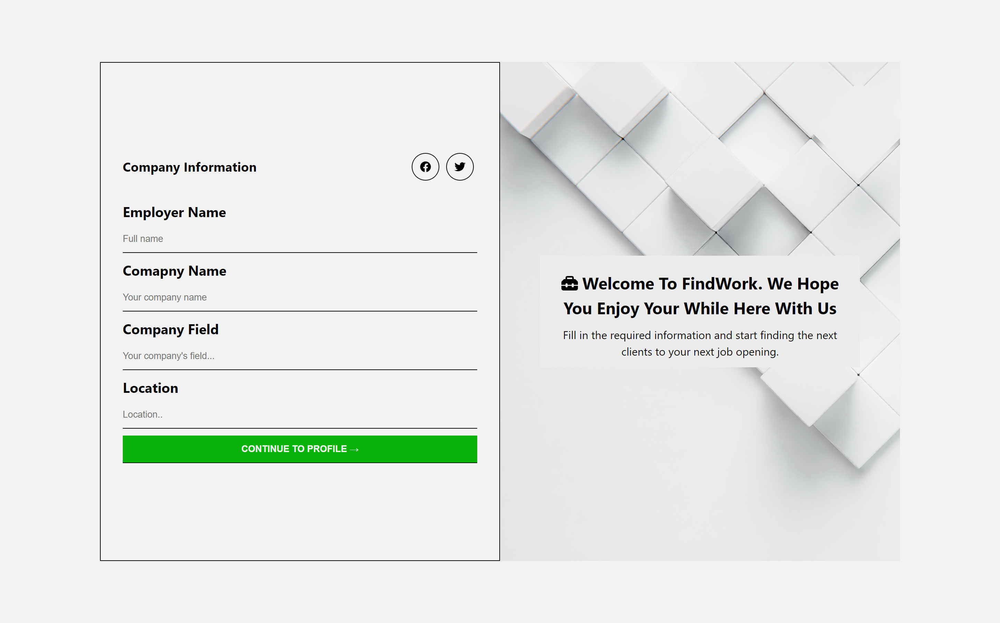

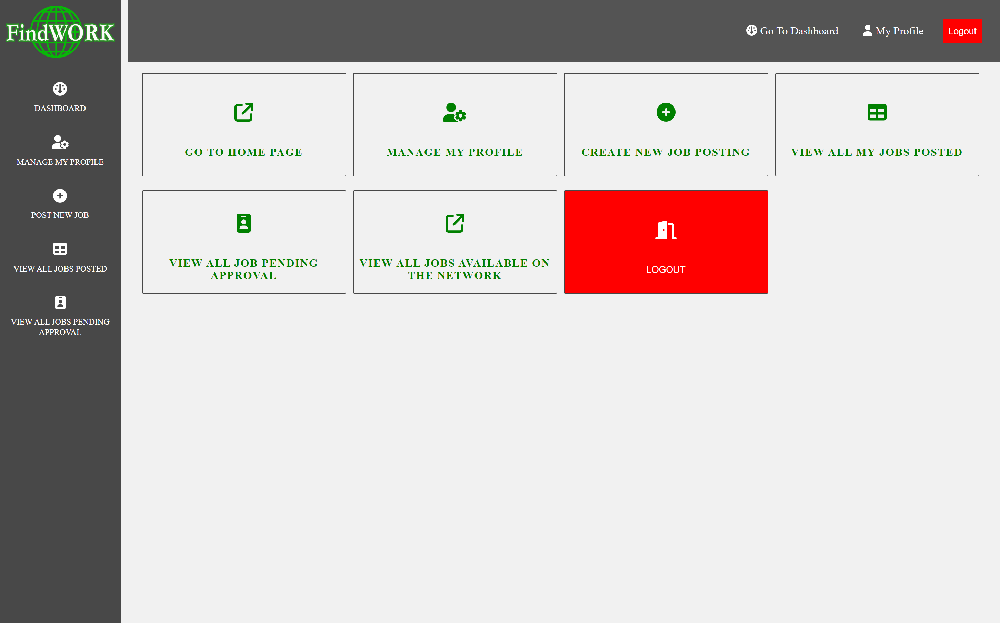

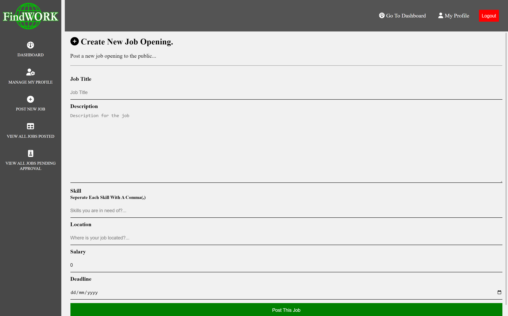


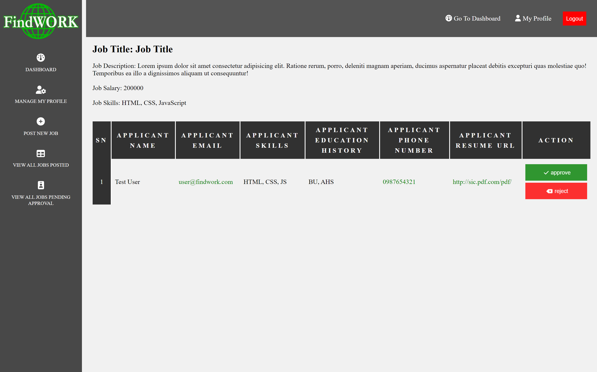

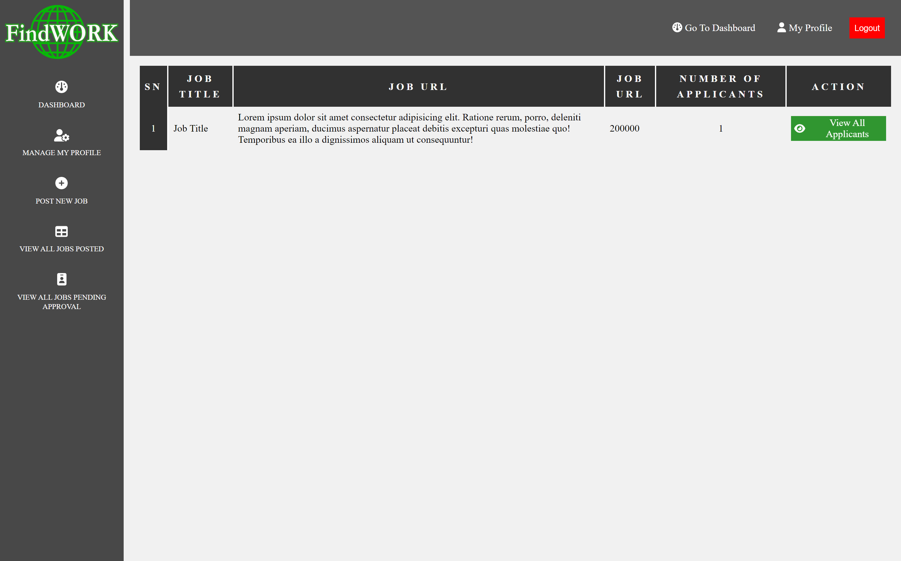

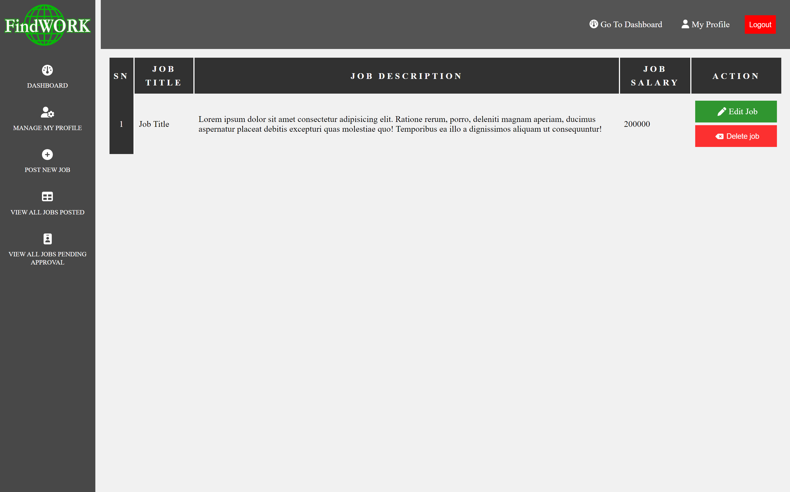


## Employees

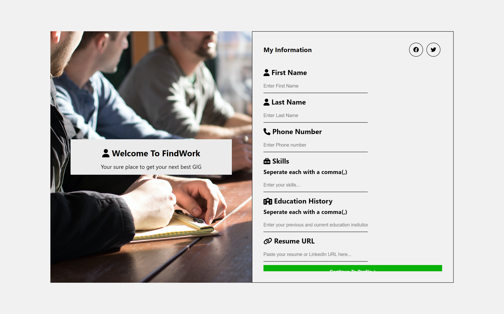

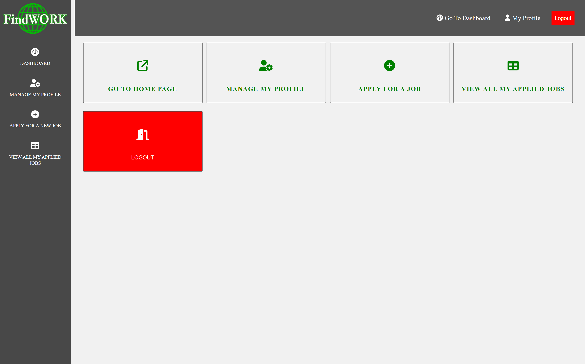

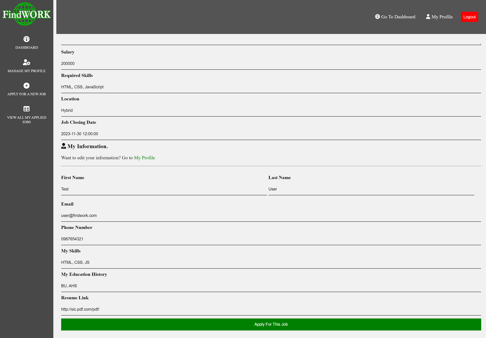

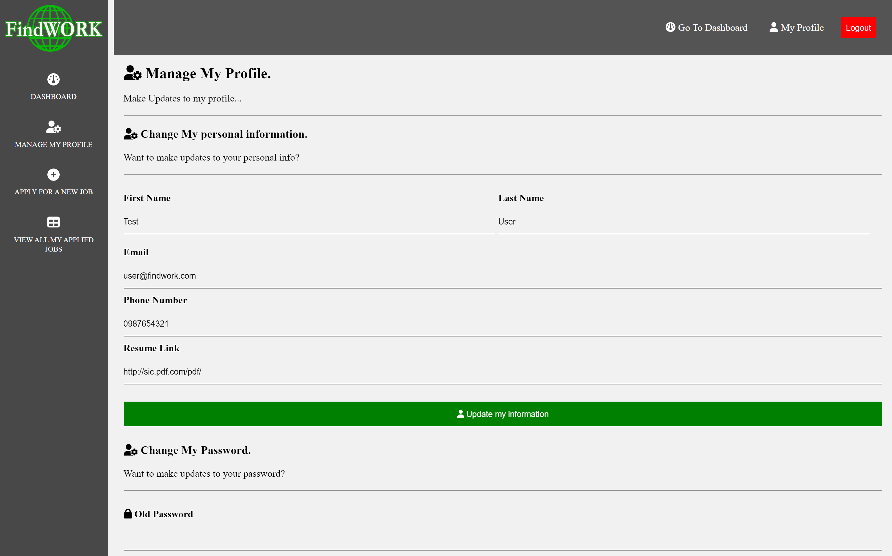


